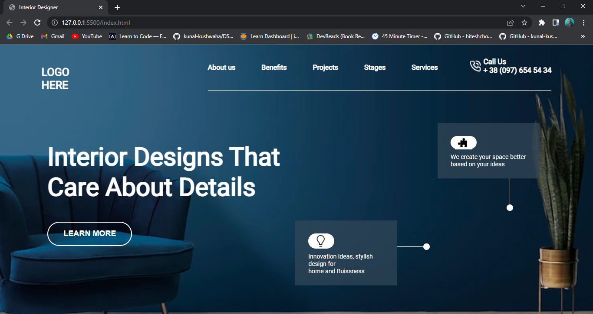

# Interior Design Landing page

Hi 👋 I am Shobhan Sundar Goutam. This project is made with the help of `HTML` and `CSS`.

 

### Screenshot

- ### Learnings from this project:-

  - Learned to use `relative` and `absolute` properties in a better way.
  - Learned to use flexbox more precisely.
  - Learned to write `html` from scratch to a full web page.

- It took around _5 hours_ to complete.

- Live Link:- [Interior Design Landing page](https://interiordesign-fsjs10.netlify.app/)
